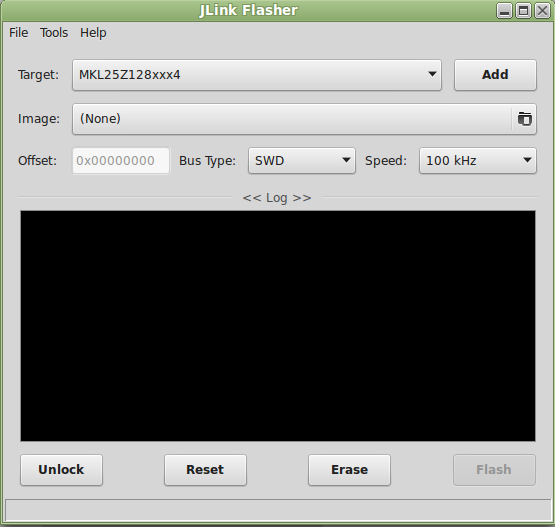

JLink-Flasher
=============

SEGGER J-Links are the most widely used line of debug probes available today. Any of this J-Link debug probe can be also used as flash programmer, what can save you a lot of time and money in developing a new product. For this purpose exist Windows application J-Flash developed by SEGGER, which can program internal and external flash on ARM/Cortex devices. Because I didn't found any similar tool for Linux, thus I have decided to create something useful by myself. And here is my first version of J-Link programmer GUI based on wxPython.

 JLink-Flasher
